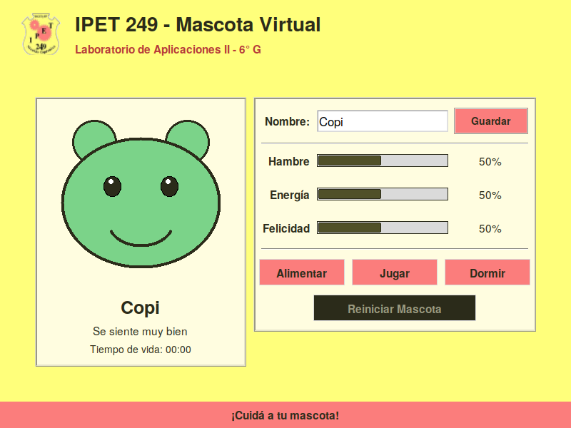
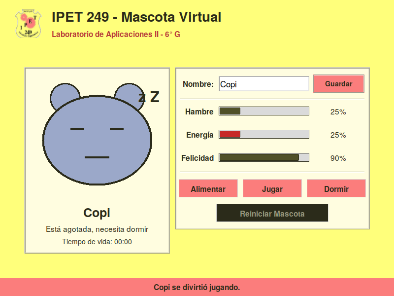
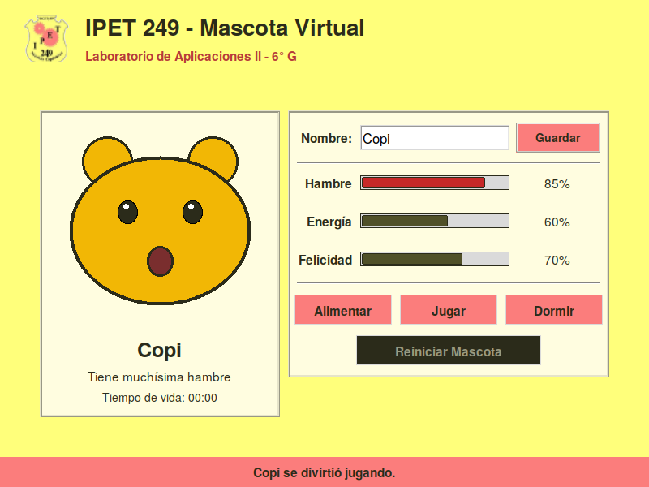
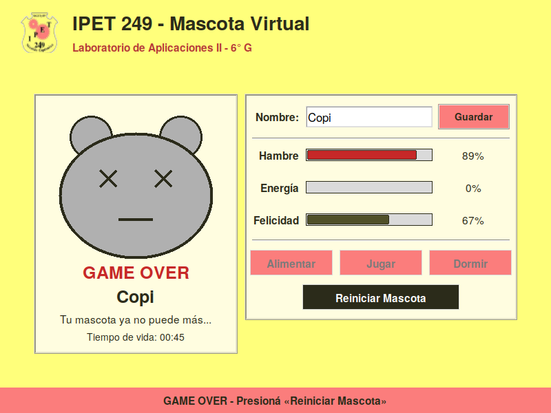

# TP N° 13 – Mascota Virtual con Tkinter

**Laboratorio de Aplicaciones II – 6° G**
**IPET N° 249 "Nicolás Copérnico"**

## 1. Datos del alumno

| | |
| --- | --- |
| **Nombre** | `jonas` |
| **Apellido** | `sarria` |
| **Curso** | 6° G |
| **Materia** | Laboratorio de Aplicaciones II |
| **Fecha de entrega** | 15-09-2026 |

## 2. Opción seleccionada y descripción funcional

**Opción 4: Mascota Virtual (Tamagotchi).** Simulación de cuidado de una mascota digital dibujada con el widget `Canvas`, cuya expresión cambia según su estado de ánimo (feliz, hambrienta, cansada, triste o fuera de juego).

### Indicadores (0 a 100)

| Indicador | Evolución con el tiempo | Condición crítica |
| --- | --- | --- |
| **Hambre** | Sube 4 puntos cada 3 s | Llega a 100 (saciedad 0) → *Game Over* |
| **Energía** | Baja 3 puntos cada 3 s | Llega a 0 → *Game Over* |
| **Felicidad** | Baja 3 puntos cada 3 s | Llega a 0 → *Game Over* |

> Como el Hambre *aumenta*, se interpretó que "llega a 0" equivale a que la saciedad se agote (Hambre = 100).

### Acciones

| Botón | Atajo | Hambre | Energía | Felicidad |
| --- | --- | :-: | :-: | :-: |
| **Alimentar** | `F1` | −25 | −5 | – |
| **Jugar** | `F2` | – | −10 | +20 |
| **Dormir** | `F3` | +10 | +30 | −10 |

- Las barras (`ttk.Progressbar`) se ponen **rojas** cuando un indicador entra en zona crítica.
- El tiempo avanza con `after()` cada **3 segundos**.
- Al producirse el **Game Over** se bloquean las tres acciones y se habilita **Reiniciar Mascota**, que devuelve los tres indicadores a **50 puntos**.
- Se puede ponerle **nombre** a la mascota (campo `Entry`; `Enter` o botón *Guardar*), validado con excepciones.

## 3. Cumplimiento de los requisitos

| Requisito | Dónde se cumple en `main.py` |
| --- | --- |
| Ventana 800x600, título y fondo institucional | `main()` → `geometry`, `title`, `configure(bg=COLOR_FONDO)` |
| Identidad IPET 249 (colores + emblema `.png`) | Paleta `COLOR_*` y `cargar_emblema()` (`assets/emblema.png`) |
| Combinación de `pack()` y `grid()` justificada | Docstring de `construir_interfaz()` |
| Al menos 3 eventos distintos | `<Return>` (teclado), `<Enter>`/`<Leave>` (mouse), `<F1>`–`<F3>` (teclado global), `WM_DELETE_WINDOW` (ventana), clic en botones |
| Mínimo 3 `Label` dinámicas | `lbl_nombre`, `lbl_estado`, `lbl_edad`, `lbl_mensaje`, porcentajes de cada indicador |
| Mínimo 3 `Button` independientes | Alimentar, Jugar, Dormir, Reiniciar (+ Guardar) |
| Al menos 1 `Entry` | `entry_nombre` |
| Al menos 2 componentes `ttk` | `ttk.Progressbar` (×3), `ttk.Separator` (×2), `ttk.Button` |
| Código identado, comentado y en funciones | Todo el archivo |
| Manejo de excepciones | `validar_nombre()` + `confirmar_nombre()` (vacío, demasiado largo, solo números), `cargar_emblema()` (`TclError`) |
| `after()` cada 3 s | `tick()` |
| *Game Over* + reinicio a 50 | `game_over()` y `reiniciar()` |

## 4. Instalación y ejecución

**Requisitos:** Python 3.8 o superior. Tkinter viene incluido en Python para Windows y macOS.

```bash
# 1. Clonar el repositorio (reemplazar por tu usuario y nombre del repo)
git clone https://github.com/<usuario>/tp13-tkinter-<nombre-apellido>.git
cd tp13-tkinter-<nombre-apellido>

# 2. (Solo Linux/Debian/Ubuntu) instalar Tkinter si no está disponible
sudo apt install python3-tk

# 3. Ejecutar
python main.py        # En algunos sistemas: python3 main.py
```

No requiere instalar librerías externas: usa solo la biblioteca estándar (`tkinter`, `os`).

### Estructura del repositorio

```
tp13-tkinter-[nombre-apellido]/
├── assets/
│   ├── emblema.png          # Emblema del IPET 249
│   └── captura_*.png        # Capturas de pantalla del README
├── main.py                  # Código fuente de la aplicación
└── README.md                # Este documento
```

## 5. Capturas de pantalla

**Inicio de la partida**



**Después de interactuar (Jugar / Alimentar)**



**Zona crítica: hambre alta (barra roja y mascota hambrienta)**



**Game Over (acciones bloqueadas, reinicio habilitado)**



## 6. Declaración sobre Inteligencia Artificial

### Herramientas utilizadas

- **Claude Sonnet 5.5 (Anthropic)**, mediante la interfaz de chat, con nivel de esfuerzo de razonamiento **alto/extra** y **medio**.
- Usos: planificación de la estructura del código, dibujo de la mascota con `Canvas`, estilos `ttk`, eventos, validación con excepciones, depuración, redacción del `README.md`, incorporación del logo del colegio y generación de las capturas de pantalla.

### Prompts de consulta (resumen de las consultas principales)

**1. Planificación inicial de la estructura**
> "Estoy haciendo el TP13 de Laboratorio de Aplicaciones II (IPET 249). Elegí la Opción 4: Mascota Virtual (Tamagotchi) con Tkinter. Necesito que me ayudes a planificar la estructura del código: constantes, diccionario de estado, funciones de lógica (alimentar, jugar, dormir, tick con after), manejo de Game Over y cómo combinar pack() y grid() sin mezclarlos en el mismo contenedor. Quiero que el código quede modular y con comentarios."

**2. Dibujo de la mascota en Canvas**
> "Ayudame a dibujar una mascota tipo osito con Canvas de Tkinter. Tiene que cambiar de color y expresión según el ánimo: feliz (verde, sonrisa), hambrienta (amarilla, boca abierta), cansada (azulada, ojos cerrados + zZ), triste y muerta (ojos en X + texto GAME OVER). Usá ovals y arcs. El canvas mide 270x260."

**3. Barras de progreso con estilo personalizado (ttk)**
> "Cómo hago para que las Progressbar de ttk cambien de color según el valor? Quiero una estilo 'Ok' (verde oscuro) y otra 'Peligro' (rojo) cuando el indicador está en zona crítica. Usá el tema 'clam' porque permite personalizar colores."

**4. Eventos y atajos de teclado**
> "Necesito implementar al menos 3 eventos distintos: `<Enter>` y `<Leave>` en los botones de acción para cambiar color y mostrar ayuda contextual; evento de teclado F1, F2 y F3 para Alimentar, Jugar y Dormir; protocolo WM_DELETE_WINDOW para confirmar antes de cerrar la ventana. Mostrame cómo hacerlo sin que se pisen los after()."

**5. Validación del nombre y manejo de excepciones**
> "Quiero validar el nombre de la mascota: no puede estar vacío, máximo 12 caracteres y no puede ser solo números. Si falla, mostrar un messagebox de warning y devolver el foco al Entry. Usá try/except con ValueError."

**6. Depuración y ajustes finales**
> "El after() se me está duplicando cuando reinicio la mascota. Cómo cancelo correctamente el job pendiente con after_cancel antes de volver a programar el tick? También revisá que los botones de acción se deshabiliten en Game Over y que el de Reiniciar solo se active cuando la mascota está muerta."

**7. Integración final (consigna completa y logo)**
> Se adjuntó el documento de la consigna y se pidió: "completa todo lo indicado en este documento a excepcion del apartado de uso de ia". Luego se adjuntó el logo del colegio ("este es el logo de la escuela") para incorporarlo como emblema y adaptar la paleta de colores.

### Porcentaje de código propio vs. asistido

|                        | Porcentaje |
| ---------------------- | ---------- |
| Código asistido por IA | 55 %       |
| Código propio          | 45 %       |

### Justificación del aporte propio

Utilicé Claude Sonnet principalmente para generar la estructura base del código, el dibujo de la mascota en el `Canvas`, los estilos de las barras de progreso (`ttk.Progressbar`) y la organización de las funciones.

Mi aporte propio consistió en:
- Adaptar y modificar la lógica de los indicadores (valores de deterioro y de las acciones Alimentar, Jugar y Dormir).
- Definir y ajustar la condición de Game Over y el sistema de reinicio.
- Elegir y aplicar la paleta de colores institucional del IPET 249.
- Escribir y corregir todos los textos de la interfaz y los mensajes de estado.
- Implementar y probar los eventos (`<Enter>`, `<Leave>`, atajos F1-F3 y cierre de ventana).
- Corregir el manejo del `after()` para que no se duplique al reiniciar.
- Probar exhaustivamente el funcionamiento general de la aplicación.

Aunque gran parte de la estructura inicial fue generada con ayuda de la IA, revisé, modifiqué y comprendí todo el código, pudiendo explicar el funcionamiento de cada sección.
